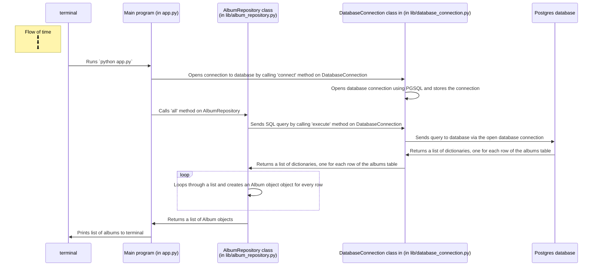

# Database Project Starter

This is a starter project for you to use to start your Python database projects.

There are two videos to support:

- [A demonstration of setting up the project](https://youtu.be/8dBADUN8gdg?t=0s)
- [A walkthrough of the project codebase](https://www.youtube.com/watch?v=8dBADUN8gdg&t=287s)

## Setup

```shell
# Clone the repository to your local machine
; git clone git@github.com:makersacademy/databases-in-python-project-starter.git YOUR_PROJECT_NAME

# Or, if you don't have SSH keys set up
; git clone https://github.com/makersacademy/databases-in-python-project-starter.git YOUR_PROJECT_NAME

# Enter the directory
; cd YOUR_PROJECT_NAME

# Install dependencies and set up the virtual environment
; pipenv install
# Read below if you see an error with `python_full_version`

# Activate the virtual environment
; pipenv shell

# Create the database
; createdb YOUR_PROJECT_NAME

# Open lib/database_connection.py and change the database name to YOUR_PROJECT_NAME
; open lib/database_connection.py

# Run the tests
; pytest

# Run the app
; python app.py
```


